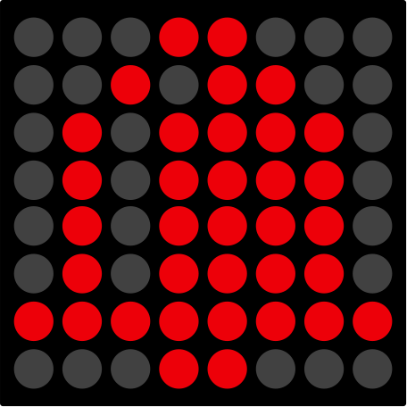

# Slot Machine Money Bank

Why have an ordinary piggybank or some box to save up change? So I've decided to take this on another level, and make saving a little bit more fun. It's not gambling, because it only takes money. There's no pay button :)

Just put some cash in, place bet and spin the reels.

Every coin counts as 20 credits.

## How it works

- Put any coin to the slot on the upper side. That gives you 20 credits.
    - This works with infrared switch, so the value is always the same.
- With the BET button place your bet for one spin.
    - TIP: If you bet more than 10 credits, the "smiley faces" are jokers - it replaces any symbol
- Push the SPIN button to spin the reels.
- If you got three same symbols you win!
- If not, you lose.
- There is no "pay" button - Therefore money bank or piggy bank. So you only save money with a little bit of fun.

### Table of winnings

The following table is for __bet of 10 credits__, three same symbols in line

| Name | Symbol | Winning |
| -- | -- | -- |
| Cherry |  | 40 |
| Lemon |  | 40 |
| Orange |  | 80 |
| Plum |  | 80 |
| Bell |  | 120 |
| Grape |  | 160 |
| Melon |  | 120 |
| Seven |  | 300 |
| Star |  | 400 |
| Joker |  | 750 |

## Bill Of Materials
- 1x Arduino Pro Micro (ATmega 32U4, 5V, 16MHz) | [Aliexpress link](https://www.aliexpress.com/item/New-Pro-Micro-for-arduino-ATmega32U4-5V-16MHz-Module-with-2-row-pin-header-For-Leonardo/32768308647.html)
- 1x IR Reflective switch | [Aliexpress link](https://www.aliexpress.com/item/1PCS-TCRT5000-Infrared-Reflective-IR-Photoelectric-Switch-Barrier-Line-Track-Sensor-Module/32817041068.html)
- 2x 45mm Arcade style Button | [Aliexpress link](https://www.aliexpress.com/item/45mm-Push-Button-Arcade-Button-Led-Micro-Switch-5V-12V-Power-Button-Switch-Set-Green-Yellow/32947388048.html)
- 1x LCD character display (16x2 characters) | [Aliexpress link](https://www.aliexpress.com/item/LCD-display-LCD1602-module-Blue-screen-1602-i2c-LCD-Display-Module-HD44780-16x2-IIC-Character-1602/32988862895.html)
- 3x 8x8 LED Dot Matrix | [Aliexpress link](https://www.aliexpress.com/item/1set-MAX7219-dot-matrix-module-control-module-MCU-control-drive-LED-module-display-module-Hbm0316/32910358174.html)
- 1x Step down converter | [Aliexpress link](https://www.aliexpress.com/item/DC-DC-Auto-Boost-Buck-adjustable-step-down-Converter-XL6009-Module-Solar-Voltage/1859100256.html)
- 1x 1W Speaker | [Aliexpress link](https://www.aliexpress.com/item/High-quality-Jtron-DIY-50mm-1W-8-Ohms-Speaker-Bronze-free-shipping/32297391375.html) 
- 1x 1K0 Trimmer | [Aliexpress link](https://www.aliexpress.com/item/3386P-2K-OHM-1-2W-Trimmer-Potentiometer-3386P-1-202-x-100PCS/2017187211.html)
- 1x DC power connector | [Aliexpress link](https://www.aliexpress.com/item/10PCS-DC-Power-Connector-pin-2-1x5-5mm-Female-Plug-Jack-Male-Plug-Jack-Socket-Adapter/32962556698.html)
- Dupont cables | [Aliexpress link](https://www.aliexpress.com/item/Free-shipping-Dupont-line-120pcs-20cm-male-to-male-male-to-female-and-female-to-female/32390991500.html)
- Prototype board | [Aliexpress link](https://www.aliexpress.com/item/10Pcs-Prototype-Paper-Copper-PCB-Universal-Experiment-Matrix-Circuit-Board-5x7CM-Diy-Kit/32888221246.html)
- M3x6 screws | [Aliexpress link](https://www.aliexpress.com/item/100PCS-M3-series-10-9-round-head-hex-socket-screws-M3-6-8-10-12-50/32773301883.html)
- M3x3x4 knurled nuts | [Aliexpress link](https://www.aliexpress.com/item/100pcs-M2-M2-5-M3-Copper-Inserts-Brass-Double-Pass-Knurl-Nut-Embedded-Fastener/32842866575.html)

## Wiring the Arduino
Use the prototype board for the Arduino and dupont cables to [connect the modules to the board](./assets/slot_machine_arduino_pinout.png).

The following wiring is for Arudino Pro Micro:

| Arduino Pin | Module Pin |
| -- | -- |
| D0(TX) | Coin inserter (IR switch's D0 pin) |
| D1(RX) | Bet Button SWITCH |
| D2 | LCD (SDA pin) |
| D3 | LCD (SCL pin) |
| D4 | DotMatrix 1 (DIN pin) |
| D5 | DotMatrix 1 (CS pin) |
| D6 | DotMatrix 1 (CLK pin) |
| D7 | DotMatrix 2 (DIN pin) |
| D8 | DotMatrix 2 (CS pin) |
| D9 | DotMatrix 2 (CLK pin) |
| D10 | Speaker |
| D16 | DotMatrix 3 (CLK pin) |
| D14 | DotMatrix 3 (CS pin) |
| D15 | DotMatrix 3 (DIN pin) |
| A0 | Start Button LED |
| A1 | Start Button SWITCH |
| A2 | Bet Button LED |
| A3 | -not connected- |
| GND | Common ground |
| RAW | +5V from the StepDown converter |

## Casing
For my slot machine I used my own design of the box, which is 3D printed, and have separated space for coins and for electronics.

You can download and print it out from [STLs](./assets/stl/). If you want to edit the design, to fit your own components (ie. speaker, trimmer, etc...), the [Fusion 360 archive files](./assets/fusion_360/) are also available. For the [BET and SPIN button](./assets/graphics/button_design.pdf), you can print out the design on a sticker, and then put it inside the button.

You may need use a drillbit to enlarge the holes a bit. It depends on your 3D printer calibration settings. (I had to use it, my printer is a bit off). Use M4 drillbit for the bigger holes, and M3 for the smaller holes.

Then put the knurled nuts into each bigger hole. In my opinon is the best for you tu put the knurled nut on a screw, and grab the screwhead with pliers. You may use a bit of force, or try to heat the nut with the lighter and then push it to the hole.